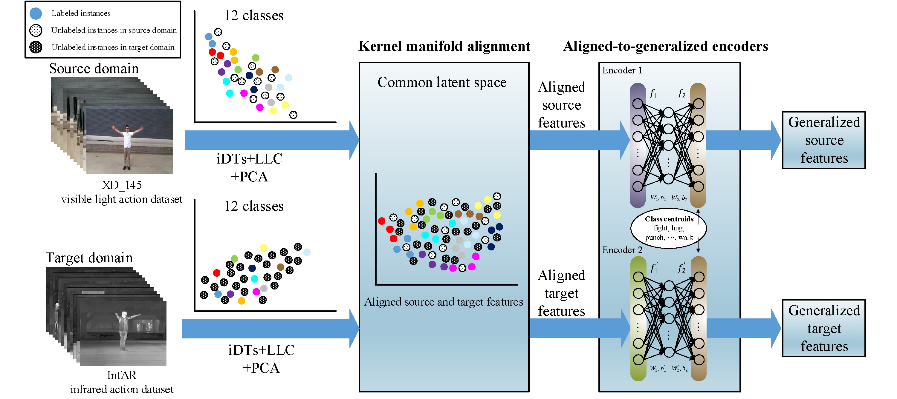
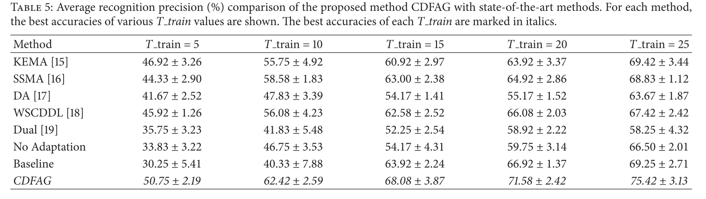
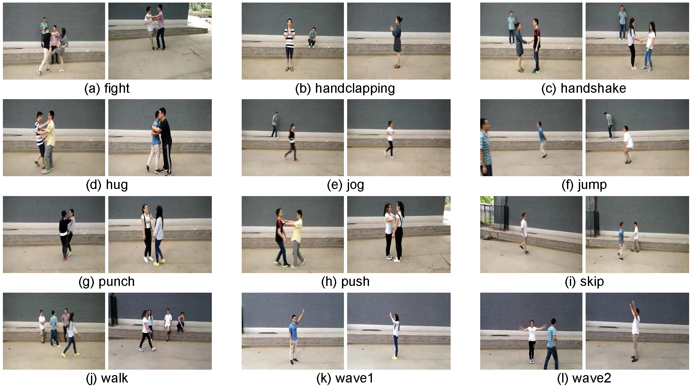
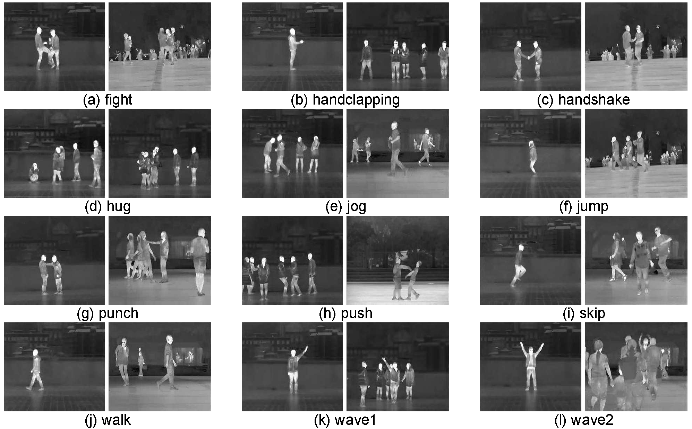

# CDFAG

<a href="https://orcid.org/0000-0002-9423-9252" target="orcid.widget" rel="noopener noreferrer" style="vertical-align:top;">orcid.org/0000-0002-9423-9252</a>

Homepage: [https://yangliu9208.github.io/home/]([https://yangliu9208.github.io/home/)

Codes for paper "Transferable Feature Representation for Visible-to-Infrared Cross-Dataset Human Action Recognition"

## Abstract

Recently, infrared human action recognition has attracted increasing attention for it has many advantages over visible light, that is, being robust to illumination change and shadows. However, the infrared action data is limited until now, which degrades the performance of infrared action recognition. Motivated by the idea of transfer learning, an infrared human action recognition framework using auxiliary data from visible light is proposed to solve the problem of limited infrared action data. In the proposed framework, we first construct a novel Cross-Dataset Feature Alignment and Generalization (CDFAG) framework to map the infrared data and visible light data into a common feature space, where Kernel Manifold Alignment (KEMA) and a dual aligned-to-generalized encoders (AGE) model are employed to represent the feature. Then, a support vector machine (SVM) is trained, using both the infrared data and visible light data, and can classify the features derived from infrared data. The proposed method is evaluated on InfAR, which is a publicly available infrared human action dataset. To build up auxiliary data, we set up a novel visible light action dataset XD145. Experimental results show that the proposed method can achieve state-of-the-art performance compared with several transfer learning and domain adaptation methods.

## Model

Figure 1: Illustration of aligned-to-generalized encoders generalizing aligned features across visible light and infrared action datasets.

## Experimental results



References

[15]  D. Tuia and G. Camps-Valls, “Kernel manifold alignment for domain adaptation,” PLoS ONE,vol.11,no.2, ArticleID e0148655, 2016.

[16]  C. Wang and S. Mahadevan, “Heterogeneous domain adaptation using manifold alignment,” in Proceedings of the 22nd International Joint Conference on Artificial Intelligence,pp. 1541– 1546, July 2011.

[17]  B.Fernando, A.Habrard, M.Sebban, and T.Tuytelaars, “Unsupervised visual domain adaptation using subspace alignment,” in Proceedings of the 2013 14th IEEE International Conference on Computer Vision, ICCV 2013, pp. 2960–2967, Australia, December 2013.

[18]  F. Zhu and L. Shao, “Weakly-supervised cross-domain dictionary learning for visual recognition,” International Journal of Computer Vision,vol.109,no. 1-2,pp.42–59,2014.

[19]  T.Xu, F.Zhu, E.K.Wong, and Y.Fang, “Dual many-to-one encoder-based transfer learning for cross-dataset human action recognition,” Image and Vision Computing,vol.55, pp.127–137, 2016.


More experimental results and discussions can be found in [paper](https://www.hindawi.com/journals/complexity/2018/5345241/).

## Dataset

We build a new visible light human action recognition dataset XD145. It can be downloaded [here](https://sites.google.com/site/yangliuxdu/home).



​                           Figure 2: 12 actions of the newly constructed visible light action dataset XD145.

InfAR dataset can be downloaded [here](https://sites.google.com/site/gaochenqiang/publication/infrared-action-dataset).



​                               Figure 3: Example images from video sequences on the InfAR dataset.

## Codes

CDFAG demo codes can be downloaded here.

Just run "CDFAG_demo.m".


If you use our codes or XD145 dataset and find our work useful, please kindly consider to cite our paper by:

```
@article{CDFAG,
  title={Transferable Feature Representation for Visible-to-Infrared Cross-Dataset Human Action Recognition},
  author={Yang Liu and Zhaoyang Lu and Jing Li and Chao Yao and Yanzi Deng},
  journal={Complexity},
  volume={2018},
  pages = {1--20},
  year={2018},
  doi = {10.1155/2018/5345241}
}
```

### Reference

Yang Liu, Zhaoyang Lu, Jing Li, Chao Yao, and Yanzi Deng, “Transferable Feature Representation for Visible-to-Infrared Cross-Dataset Human Action Recognition,” *Complexity*, vol. 2018, Article ID 5345241, 20 pages, 2018. doi:10.1155/2018/5345241

If you have any question about this code, feel free to reach me(aryanr@163.com)

<a href='https://clustrmaps.com/site/1a4al'  title='Visit tracker'></a>
